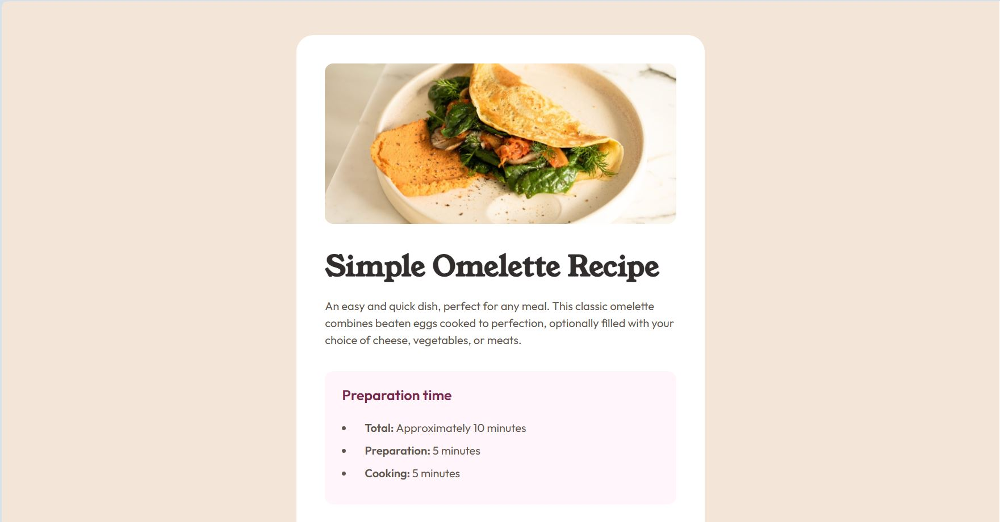

# Frontend Mentor - Recipe page solution

This is a solution to the [Recipe page challenge on Frontend Mentor](https://www.frontendmentor.io/challenges/recipe-page-KiTsR8QQKm). Frontend Mentor challenges help you improve your coding skills by building realistic projects. 

## Table of contents

- [Overview](#overview)
  - [The challenge](#the-challenge)
  - [Screenshot](#screenshot)
  - [Links](#links)
  - [Built with](#built-with)
  - [What I learned](#what-i-learned)
  - [Useful resources](#useful-resources)
  - [Author](#author)

## Overview
Recipe page responsive design using HTML and CSS.

### Screenshot

### Links

- Solution URL: [https://github.com/monicaivanov/recipe-page-main]
- Live Site URL: [https://monicaivanov.github.io/recipe-page-main/]

### Built with

- Semantic HTML5 markup
- CSS custom properties
- Flexbox
- CSS Grid

### What I learned
I remembered how to use tables in HTML and style them. I did struggle to align the tables with the H1/H2 text.

### Useful resources

No new resources.

## Author

- Frontend Mentor - [@monicaivanov](https://www.frontendmentor.io/profile/monicaivanov)

